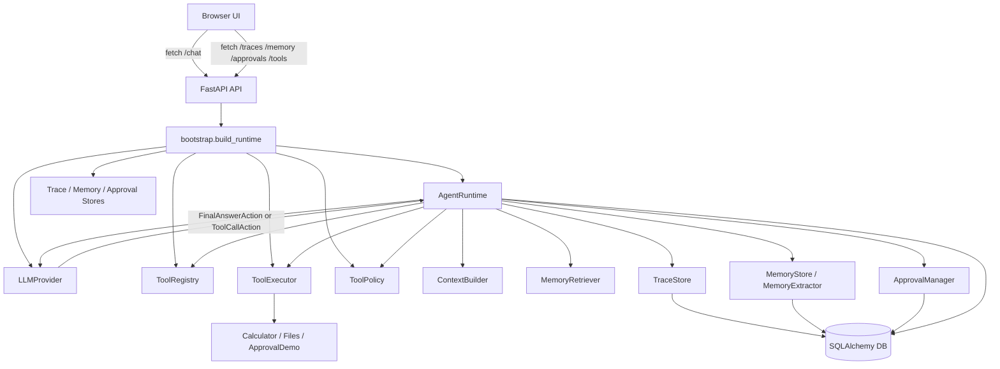
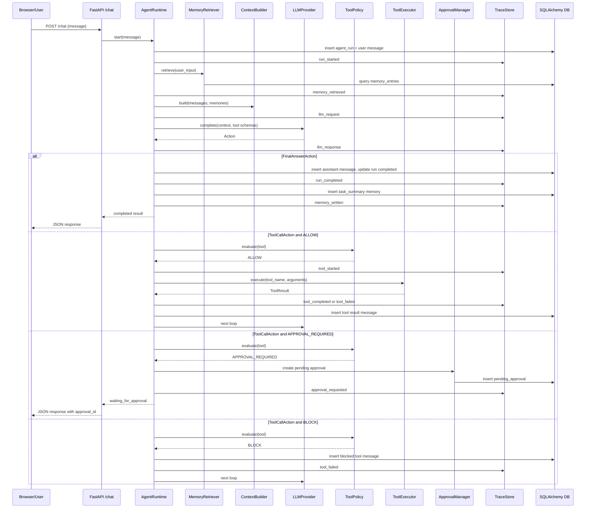

# Personal Agent Hub v2 Project Guide

本文档只根据当前仓库代码分析，不把未来计划当成已实现功能。

## 1. 项目当前目标

### 这个项目解决什么问题

当前项目实现了一个轻量级 Agent Harness，用来把一次用户请求变成可观察、可审批、可持久化的 Agent Run。

它解决的核心问题是：

- 接收用户输入。
- 调用 LLM Provider，让模型决定输出最终答案还是调用工具。
- 将供应商返回结果转换成内部 Action。
- 根据工具风险等级执行 Policy。
- 对安全工具直接执行，对高风险工具暂停并等待人工审批。
- 记录 Trace。
- 写入和检索简单长期 Memory。
- 通过 Web UI 展示 Chat、Trace、Memory、Approvals、Tools。

### 当前更接近什么

它目前更接近 **Agent Harness / Agent Runtime**，而不是完整 Agent App。

原因：

- 核心价值在 `backend/runtime/loop.py` 的 Agent Loop、Tool、Policy、Trace、Memory、Approval。
- Web UI 存在，但主要是控制面板和演示界面，不是完整产品型应用。
- Runtime 自己实现了 Action 分发、工具执行、审批暂停和恢复，没有使用 LangGraph/CrewAI 等外部 Agent 框架。

更准确地说：

```text
当前项目 = 可运行的 Agent Harness + 简洁 Control Plane UI
```

## 2. 完整目录树

忽略 `.git`、`.venv`、`data`、缓存、构建产物。

```text
.
├── .dockerignore                  # Docker 构建忽略规则
├── .env.example                   # 环境变量模板
├── .gitignore                     # Git 忽略规则
├── Dockerfile                     # 容器构建入口
├── README.md                      # 面向使用者的项目说明
├── PROJECT_GUIDE.md               # 当前文档
├── alembic.ini                    # Alembic 配置
├── pyproject.toml                 # Python 项目配置和测试配置
├── requirements.txt               # 运行和测试依赖
├── alembic/
│   ├── env.py                     # Alembic 迁移运行环境
│   └── versions/
│       └── 0001_initial_schema.py # 初始数据库 schema
├── backend/
│   ├── __init__.py
│   ├── bootstrap.py               # 组装 Runtime、Provider、Tools、Stores
│   ├── main.py                    # FastAPI app 和静态前端入口
│   ├── api/
│   │   ├── __init__.py
│   │   ├── approvals.py           # 审批列表、approve、reject API
│   │   ├── chat.py                # POST /chat
│   │   ├── memory.py              # Memory 查询和删除 API
│   │   ├── tools.py               # Tools 列表 API
│   │   └── traces.py              # Trace 查询 API
│   ├── approval/
│   │   ├── __init__.py
│   │   ├── manager.py             # PendingApproval 创建、查询、解决
│   │   └── models.py              # pending_approvals ORM Model
│   ├── config/
│   │   ├── __init__.py
│   │   └── settings.py            # 环境变量读取
│   ├── llm/
│   │   ├── __init__.py
│   │   ├── base.py                # LLMProvider 抽象
│   │   ├── fake.py                # 本地演示 Fake Provider
│   │   └── openai_compatible.py   # OpenAI-compatible Provider
│   ├── memory/
│   │   ├── __init__.py
│   │   ├── extractor.py           # Run 完成后写 task_summary memory
│   │   ├── models.py              # memory_entries ORM Model
│   │   ├── retrieval.py           # SQLAlchemy MemoryRetriever
│   │   └── store.py               # Memory 增删查
│   ├── runtime/
│   │   ├── __init__.py
│   │   ├── actions.py             # FinalAnswerAction / ToolCallAction
│   │   ├── context.py             # ContextBuilder
│   │   ├── events.py              # TraceEventType 枚举
│   │   ├── loop.py                # AgentRuntime 主循环
│   │   └── state.py               # AgentRunResult
│   ├── static/
│   │   ├── app.js                 # 前端逻辑
│   │   ├── index.html             # 前端页面结构
│   │   └── styles.css             # 前端样式
│   ├── storage/
│   │   ├── __init__.py
│   │   ├── database.py            # SQLAlchemy Base、engine、Session
│   │   └── models.py              # agent_runs、messages ORM Model
│   ├── tools/
│   │   ├── __init__.py
│   │   ├── base.py                # Tool/RiskLevel/ToolResult
│   │   ├── executor.py            # ToolExecutor
│   │   ├── policy.py              # ToolPolicy
│   │   ├── registry.py            # ToolRegistry
│   │   └── builtin/
│   │       ├── __init__.py
│   │       ├── approval_demo.py   # WRITE 风险审批演示工具
│   │       ├── calculator.py      # 安全算术工具
│   │       └── files.py           # read_file/search_files
│   └── trace/
│       ├── __init__.py
│       ├── models.py              # trace_events ORM Model
│       └── store.py               # Trace 写入和查询
├── docs/
│   └── architecture.md            # Mermaid 架构说明
├── frontend/
│   └── README.md                  # 说明当前前端由 backend/static 托管
└── tests/
    ├── __init__.py
    ├── conftest.py                # 测试夹具、FakeLLMProvider、测试 Runtime 组装
    ├── integration/
    │   └── test_api.py            # API 集成测试
    ├── memory/
    │   └── test_memory.py         # Memory store/retrieval 测试
    ├── runtime/
    │   └── test_loop.py           # Agent Loop 测试
    └── tools/
        └── test_tools.py          # 工具和 Policy 测试
```

## 3. 一次请求的完整执行链路

以 `POST /chat` 为主线。

### 3.1 API 请求进入

涉及文件：

- `backend/main.py`
- `backend/api/chat.py`
- `backend/storage/database.py`
- `backend/config/settings.py`
- `backend/bootstrap.py`

流程：

1. 浏览器前端 `backend/static/app.js` 调用：

   ```js
   fetch("/chat", { method: "POST", body: JSON.stringify({ message: text }) })
   ```

2. FastAPI 在 `backend/main.py:create_app()` 中注册 `chat.router`。

3. 请求进入 `backend/api/chat.py:chat()`：

   ```python
   @router.post("/chat")
   def chat(request, session=Depends(get_session), settings=Depends(load_settings))
   ```

4. `get_session()` 从 `backend/storage/database.py` 创建 SQLAlchemy Session。

5. `load_settings()` 从环境变量读取：

   - `DATABASE_URL`
   - `LLM_PROVIDER`
   - `LLM_BASE_URL`
   - `LLM_API_KEY`
   - `LLM_MODEL`
   - `WORKSPACE_DIR`
   - `AGENT_MAX_STEPS`

6. `build_runtime(session, settings)` 组装 Runtime。

### 3.2 Runtime 创建 run

涉及文件：

- `backend/runtime/loop.py`
- `backend/storage/models.py`
- `backend/trace/store.py`
- `backend/runtime/events.py`

入口：

```python
AgentRuntime.start(user_message)
```

做的事：

1. 创建 `AgentRunRecord`：

   - `id = run_xxx`
   - `status = "running"`
   - `user_input = user_message`
   - `steps = 0`

2. 写入第一条 `MessageRecord`：

   - `role = "user"`
   - `content = user_message`
   - `raw = {"role": "user", "content": user_message}`

3. 写入 Trace：

   - `run_started`

4. 提交数据库。

5. 调用 `_continue(run.id)` 进入循环。

### 3.3 Agent Loop

涉及文件：

- `backend/runtime/loop.py`
- `backend/memory/retrieval.py`
- `backend/runtime/context.py`
- `backend/llm/base.py`
- `backend/llm/openai_compatible.py`
- `backend/llm/fake.py`

核心逻辑：

```python
while run.steps < self.max_steps:
    run.steps += 1
    messages = self._load_messages(run.id)
    memories = self.memory_retriever.retrieve(run.user_input)
    context = self.context_builder.build(messages, memories)
    action = self.llm_provider.complete(messages=context, tools=schemas)
```

每轮会：

1. 加一轮 `steps`。
2. 从 `messages` 表加载当前 run 的消息。
3. 用 `SQLAlchemyMemoryRetriever.retrieve()` 检索 Memory。
4. 写 Trace `memory_retrieved`。
5. 用 `ContextBuilder.build()` 生成 LLM 上下文。
6. 写 Trace `llm_request`。
7. 调用 LLM Provider。
8. Provider 返回内部 `AgentAction`。
9. 写 Trace `llm_response`。

### 3.4 LLM 调用和 Action 转换

涉及文件：

- `backend/llm/base.py`
- `backend/llm/openai_compatible.py`
- `backend/llm/fake.py`
- `backend/runtime/actions.py`

当前有两个 Provider：

1. `OpenAICompatibleProvider`

   - 使用 `OpenAI(...).chat.completions.create(...)`
   - 传入 `messages` 和 `tools`
   - 如果返回 `tool_calls`，转换为 `ToolCallAction`
   - 否则转换为 `FinalAnswerAction`

2. `FakeRuleBasedProvider`

   - 本地演示用
   - 如果用户文本包含 `approval` 或 `审批`，返回 `approval_demo` 的 `ToolCallAction`
   - 如果能提取算术表达式，返回 `calculator` 的 `ToolCallAction`
   - 如果上一条消息是 `role="tool"`，返回 `FinalAnswerAction`

Runtime 不直接理解 OpenAI response object，只处理：

```python
FinalAnswerAction(content)
ToolCallAction(call_id, tool_name, arguments, assistant_message)
```

### 3.5 FinalAnswer 分支

涉及文件：

- `backend/runtime/loop.py`
- `backend/memory/extractor.py`
- `backend/trace/store.py`

条件：

```python
isinstance(action, FinalAnswerAction)
```

流程：

1. 调用 `_complete_run(run, action.content)`。
2. 写入 assistant message。
3. 设置：

   - `run.status = "completed"`
   - `run.answer = answer`

4. 写 Trace `run_completed`。
5. 调用 `MemoryExtractor.write_task_summary()`：

   - 写入 `memory_entries`
   - 类型固定为 `task_summary`
   - source 为 `run:{run_id}`

6. 写 Trace `memory_written`。
7. 返回 `AgentRunResult`。
8. API 转成 `ChatResponse`。

### 3.6 ToolCall 分支

涉及文件：

- `backend/runtime/loop.py`
- `backend/tools/registry.py`
- `backend/tools/policy.py`
- `backend/tools/executor.py`
- `backend/tools/base.py`

条件：

```python
isinstance(action, ToolCallAction)
```

流程：

1. `_handle_tool_call(run, action)`。
2. 先保存 LLM 的 assistant tool-call message。
3. 写 Trace `tool_requested`。
4. `ToolRegistry.get(action.tool_name)` 查找工具。

分支 A：未知工具

- 写 tool message：`Unknown tool: ...`
- 写 Trace `tool_failed`
- commit
- 继续下一轮 LLM

分支 B：Policy BLOCK

- `ToolPolicy.evaluate(tool)` 返回 `BLOCK`
- 写 tool message：`Tool blocked by policy: ...`
- 写 Trace `tool_failed`
- commit
- 继续下一轮 LLM

分支 C：Policy APPROVAL_REQUIRED

- 创建 `PendingApprovalRecord`
- 设置 `run.status = "waiting_for_approval"`
- 写 Trace `approval_requested`
- commit
- 返回 `AgentRunResult(status="waiting_for_approval", approval_id=...)`
- 这次 Agent Run 暂停，不继续调用 LLM

分支 D：Policy ALLOW

- 调用 `_execute_tool_call(...)`
- 写 Trace `tool_started`
- `ToolExecutor.execute(tool_name, arguments)`
- Tool 成功则写 Trace `tool_completed`
- Tool 异常则 `ToolExecutor` 捕获，并写 Trace `tool_failed`
- 写 tool result message
- commit
- 继续下一轮 LLM

### 3.7 HITL Approval 恢复

涉及文件：

- `backend/api/approvals.py`
- `backend/approval/manager.py`
- `backend/runtime/loop.py`
- `backend/approval/models.py`

入口：

```text
POST /approvals/{approval_id}/approve
POST /approvals/{approval_id}/reject
```

API 调用：

```python
runtime.resume_from_approval(approval_id, approved=True/False)
```

Approve 分支：

1. `ApprovalManager.resolve()` 把 pending approval 改成 `approved`。
2. `run.status = "running"`。
3. 写 Trace `approval_resolved`。
4. 执行原工具调用：

   ```python
   _execute_tool_call(run, approval.tool_call_id, approval.tool_name, approval.arguments)
   ```

5. commit。
6. 重新进入 `_continue(run.id)`。
7. 继续调用 LLM。
8. 最终 completed 或 failed。

Reject 分支：

1. `ApprovalManager.resolve()` 把 approval 改成 `rejected`。
2. 写 Trace `approval_resolved`。
3. 不执行工具。
4. 写一条 tool message：

   ```text
   Approval rejected by human.
   ```

5. commit。
6. 重新进入 `_continue(run.id)`。

### 3.8 Memory

涉及文件：

- `backend/memory/retrieval.py`
- `backend/memory/store.py`
- `backend/memory/extractor.py`
- `backend/memory/models.py`

在每一轮 LLM 前：

- `SQLAlchemyMemoryRetriever.retrieve(run.user_input)`
- 根据用户原始输入拆词，并用 SQLAlchemy `ilike` 查 `memory_entries.content` 和 `memory_entries.type`
- 结果放入 `ContextBuilder`

在 Run 完成后：

- `MemoryExtractor.write_task_summary()`
- 写 `task_summary`

注意：

- 当前没有 LLM-based memory extraction。
- 当前没有向量库。
- 当前没有 SQLite FTS5。

### 3.9 Trace

涉及文件：

- `backend/trace/store.py`
- `backend/trace/models.py`
- `backend/runtime/events.py`

Trace 是数据库表 `trace_events`。

Runtime 写入事件：

- `run_started`
- `memory_retrieved`
- `llm_request`
- `llm_response`
- `tool_requested`
- `tool_started`
- `tool_completed`
- `tool_failed`
- `approval_requested`
- `approval_resolved`
- `memory_written`
- `run_completed`
- `run_failed`

查询入口：

```text
GET /traces/{run_id}
```

### 3.10 最终 response

`backend/api/chat.py:to_response()` 返回：

```json
{
  "run_id": "...",
  "status": "completed | failed | waiting_for_approval",
  "answer": "... or null",
  "approval_id": "... or null",
  "trace": [...]
}
```

## 4. 核心模块说明

### api

负责什么：

- 暴露 HTTP API。
- 将请求转换成 Runtime 调用。
- 将 Runtime 结果转换成 HTTP response。

输入：

- HTTP request。
- SQLAlchemy Session。
- Settings。

输出：

- JSON response。

调用了谁：

- `build_runtime()`
- `MemoryStore`
- `TraceStore`
- `ApprovalManager`
- `build_tool_registry()`

被谁调用：

- FastAPI 路由系统。
- 前端 `backend/static/app.js`。

### runtime

负责什么：

- Agent Loop。
- Run 创建和状态推进。
- Action 分发。
- ToolCall 处理。
- Approval pause/resume。
- Trace 和 Memory 写入的主协调。

输入：

- 用户消息。
- LLMProvider。
- ToolRegistry/ToolExecutor/ToolPolicy。
- Stores。

输出：

- `AgentRunResult`。

调用了谁：

- `LLMProvider.complete()`
- `ToolPolicy.evaluate()`
- `ToolExecutor.execute()`
- `ApprovalManager`
- `TraceStore`
- `MemoryRetriever`
- `MemoryExtractor`
- `ContextBuilder`

被谁调用：

- `backend/api/chat.py`
- `backend/api/approvals.py`

### llm

负责什么：

- 抽象 LLM Provider。
- 把供应商原始响应转换为内部 Action。

输入：

- `messages`
- `tools`

输出：

- `FinalAnswerAction`
- `ToolCallAction`

调用了谁：

- `openai.OpenAI`，仅在 `OpenAICompatibleProvider` 中。

被谁调用：

- `AgentRuntime`

### tools

负责什么：

- 定义工具接口。
- 管理工具注册。
- 将工具 schema 暴露给 LLM。
- 执行工具并捕获异常。
- 根据风险等级做 policy 判断。

输入：

- ToolCallAction 的 `tool_name` 和 `arguments`。

输出：

- `ToolResult`
- LLM tool schema
- public tool info

调用了谁：

- 各具体工具的 `execute()`。

被谁调用：

- `AgentRuntime`
- `/tools` API

### memory

负责什么：

- 长期记忆的增删查。
- 基于用户输入检索相关 memory。
- Run 完成后写入 task summary。

输入：

- `user_input`
- `answer`
- API 的 delete 请求

输出：

- memory entry dict。
- context memories。

调用了谁：

- SQLAlchemy Session。
- `TraceStore`，用于记录 `memory_written`。

被谁调用：

- `AgentRuntime`
- `/memory` API

### approval

负责什么：

- 创建 PendingApproval。
- 查询 pending approvals。
- approve/reject 并更新状态。

输入：

- ToolCallAction。
- Tool。
- PolicyDecision。
- approval_id。

输出：

- `PendingApprovalRecord`
- serialized approval dict。

调用了谁：

- SQLAlchemy Session。

被谁调用：

- `AgentRuntime`
- `/approvals` API

### trace

负责什么：

- 结构化记录 Agent Run 事件。
- 按 run_id 返回事件序列。

输入：

- `run_id`
- `event_type`
- `payload`

输出：

- trace event dict list。

调用了谁：

- SQLAlchemy Session。

被谁调用：

- `AgentRuntime`
- `MemoryExtractor`
- `/traces` API

### storage

负责什么：

- SQLAlchemy Base。
- Engine。
- SessionLocal。
- agent_runs/messages ORM models。

输入：

- `DATABASE_URL`

输出：

- SQLAlchemy Session。
- ORM Models。

调用了谁：

- SQLAlchemy。

被谁调用：

- FastAPI dependency。
- Alembic。
- Stores 和 Runtime。

### config

负责什么：

- 从环境变量读取配置。

输入：

- 环境变量。

输出：

- `Settings`

调用了谁：

- `os.getenv`
- `Path.resolve`

被谁调用：

- API dependency。
- storage/database 模块加载。
- bootstrap。

### frontend

负责什么：

- 提供浏览器可用的 Agent Control Plane。
- Chat 输入。
- Run status 展示。
- Trace/Memory/Approvals/Tools 展示。
- Approval approve/reject 操作。

输入：

- 用户在 textarea 输入。
- 点击 tab、refresh、approve/reject/delete。

输出：

- DOM 更新。
- 对后端 API 的 fetch 请求。

调用了谁：

- `/chat`
- `/traces/{run_id}`
- `/memory`
- `/approvals`
- `/approvals/{id}/approve`
- `/approvals/{id}/reject`
- `/tools`

被谁调用：

- 浏览器。

## 5. 核心类 / 函数索引

| 文件路径 | 名称 | 职责 | 关系 |
|---|---|---|---|
| `backend/main.py` | `create_app()` | 创建 FastAPI app、注册 API、挂载静态前端 | 应用入口 |
| `backend/bootstrap.py` | `build_runtime()` | 组装 Runtime 依赖 | API 调用它获取 Runtime |
| `backend/bootstrap.py` | `build_tool_registry()` | 注册内置工具 | Runtime 和 `/tools` 使用 |
| `backend/bootstrap.py` | `build_llm_provider()` | 根据 `LLM_PROVIDER` 选择 fake/openai provider | Runtime 依赖 |
| `backend/runtime/loop.py` | `AgentRuntime` | Agent Loop 核心类 | 调用 LLM、Tools、Policy、Trace、Memory、Approval |
| `backend/runtime/loop.py` | `start()` | 创建新 run 并进入 loop | `/chat` 入口 |
| `backend/runtime/loop.py` | `resume_from_approval()` | 审批后恢复 run | `/approvals/{id}/approve/reject` 入口 |
| `backend/runtime/loop.py` | `_continue()` | while loop，每轮构造 context、调用 LLM、处理 action | Runtime 核心 |
| `backend/runtime/loop.py` | `_handle_tool_call()` | 查工具、做 Policy、审批或执行 | ToolCall 分支 |
| `backend/runtime/loop.py` | `_execute_tool_call()` | 执行工具并记录结果 | 调用 ToolExecutor |
| `backend/runtime/actions.py` | `FinalAnswerAction` | 内部最终答案动作 | LLM Provider 返回 |
| `backend/runtime/actions.py` | `ToolCallAction` | 内部工具调用动作 | LLM Provider 返回 |
| `backend/runtime/context.py` | `ContextBuilder.build()` | system prompt + memory + messages | Runtime 调 LLM 前调用 |
| `backend/llm/base.py` | `LLMProvider` | LLM 抽象接口 | Runtime 依赖抽象 |
| `backend/llm/openai_compatible.py` | `OpenAICompatibleProvider` | OpenAI-compatible adapter | 真实 provider |
| `backend/llm/fake.py` | `FakeRuleBasedProvider` | 本地演示 provider | `LLM_PROVIDER=fake` |
| `backend/tools/base.py` | `Tool` | 工具抽象接口 | 内置工具继承 |
| `backend/tools/base.py` | `ToolResult` | 工具执行结果结构 | Executor/Runtime 使用 |
| `backend/tools/registry.py` | `ToolRegistry` | 注册、查找、导出 schema | Runtime 和 `/tools` 使用 |
| `backend/tools/policy.py` | `ToolPolicy.evaluate()` | 根据 risk_level 判断 allow/approval/block | Runtime ToolCall 分支 |
| `backend/tools/executor.py` | `ToolExecutor.execute()` | 执行工具并捕获异常 | Runtime 调用 |
| `backend/tools/builtin/calculator.py` | `CalculatorTool` | 安全 AST 算术计算 | READ_ONLY 工具 |
| `backend/tools/builtin/files.py` | `ReadFileTool` | 读取 workspace 内文件 | READ_ONLY 工具 |
| `backend/tools/builtin/files.py` | `SearchFilesTool` | 搜索 workspace 内文件 | READ_ONLY 工具 |
| `backend/tools/builtin/approval_demo.py` | `ApprovalDemoTool` | 审批流程演示 | WRITE 工具 |
| `backend/approval/manager.py` | `ApprovalManager` | 创建、查询、解决审批 | Runtime/API 使用 |
| `backend/memory/store.py` | `MemoryStore` | Memory CRUD | Runtime/API 使用 |
| `backend/memory/retrieval.py` | `SQLAlchemyMemoryRetriever` | 简单 Memory 检索 | Runtime 使用 |
| `backend/memory/extractor.py` | `MemoryExtractor` | Run 完成后写 task_summary | Runtime 使用 |
| `backend/trace/store.py` | `TraceStore` | Trace append/list | Runtime/API 使用 |
| `backend/storage/database.py` | `get_session()` | FastAPI DB Session dependency | API 使用 |
| `backend/config/settings.py` | `load_settings()` | 读取环境变量 | API/storage 使用 |
| `backend/static/app.js` | `handleRunResult()` | 前端处理 chat/approval 返回结果 | 浏览器调用 |

## 6. 数据模型

### agent_runs

ORM：

- `backend/storage/models.py:AgentRunRecord`

字段：

- `id`
- `status`
- `user_input`
- `answer`
- `steps`
- `created_at`
- `updated_at`

用途：

- 持久化一次 Agent Run 的整体状态。

状态值从代码可见：

- `running`
- `waiting_for_approval`
- `completed`
- `failed`

### messages

ORM：

- `backend/storage/models.py:MessageRecord`

字段：

- `id`
- `run_id`
- `role`
- `content`
- `tool_call_id`
- `tool_name`
- `raw`
- `sequence`
- `created_at`

用途：

- 保存一次 run 的消息历史。
- `raw` 保存 OpenAI-compatible message dict，使 resume 可以重建上下文。

### memory_entries

ORM：

- `backend/memory/models.py:MemoryEntryRecord`

字段：

- `id`
- `type`
- `content`
- `source`
- `metadata`
- `created_at`

用途：

- 保存长期记忆。
- 当前自动写入类型是 `task_summary`。

### pending_approvals

ORM：

- `backend/approval/models.py:PendingApprovalRecord`

字段：

- `id`
- `run_id`
- `tool_call_id`
- `tool_name`
- `arguments`
- `assistant_message`
- `risk_level`
- `reason`
- `status`
- `created_at`
- `resolved_at`

用途：

- 保存等待人工确认的工具调用。
- 持久化了恢复执行所需的 tool call 信息。

### trace_events

ORM：

- `backend/trace/models.py:TraceEventRecord`

字段：

- `id`
- `run_id`
- `type`
- `payload`
- `sequence`
- `timestamp`

用途：

- 保存结构化执行轨迹。

### 表之间的关系

代码中没有定义 SQLAlchemy `relationship()` 或数据库外键约束。

实际逻辑关系是：

```text
agent_runs.id
  -> messages.run_id
  -> trace_events.run_id
  -> pending_approvals.run_id

memory_entries 独立存在，source 可以保存 run:{run_id}
```

### 哪些状态需要持久化

已经持久化：

- run 状态和答案。
- message 历史。
- pending approval。
- trace events。
- long-term memory。

未单独持久化为专门状态对象：

- ContextBuilder 生成的完整上下文。
- ToolRegistry 注册状态。
- Provider 实例状态。
- 当前 Python 调用栈。

## 7. API 清单

| Method | Path | Request | Response | 用途 |
|---|---|---|---|---|
| `GET` | `/` | 无 | HTML | 返回前端页面 |
| `POST` | `/chat` | `{"message": "..."}` | `{run_id,status,answer,approval_id,trace}` | 启动一次 Agent Run |
| `GET` | `/traces/{run_id}` | path: `run_id` | trace event list | 查询某次 run 的结构化执行轨迹 |
| `GET` | `/memory` | 无 | memory entry list | 查看长期记忆 |
| `DELETE` | `/memory/{memory_id}` | path: `memory_id` | `{"deleted": true}` | 删除长期记忆 |
| `GET` | `/tools` | 无 | tool public info list | 查看当前注册工具 |
| `GET` | `/approvals` | 无 | pending approval list | 查看待审批工具调用 |
| `POST` | `/approvals/{approval_id}/approve` | path: `approval_id` | `{run_id,status,answer,approval_id,trace}` | 批准并恢复 run |
| `POST` | `/approvals/{approval_id}/reject` | path: `approval_id` | `{run_id,status,answer,approval_id,trace}` | 拒绝并恢复 run |

## 8. Agent State

### 一次执行过程中保存了哪些状态

内存中：

- `AgentRuntime` 实例和依赖对象。
- 当前函数局部变量：
  - `run`
  - `messages`
  - `memories`
  - `context`
  - `action`
  - `tool result`
- 当前 SQLAlchemy Session。
- ToolRegistry 的工具实例。
- LLMProvider 实例。

数据库中：

- `agent_runs.status`
- `agent_runs.steps`
- `agent_runs.answer`
- `messages`
- `pending_approvals`
- `trace_events`
- `memory_entries`

### 哪些只存在内存

- 每一轮即时生成的 `context`。
- `ToolPolicy` 对象。
- `ToolRegistry` 对象。
- `ToolExecutor` 对象。
- LLM Provider 客户端对象。
- `AgentRunResult` 返回对象。

### 哪些已经持久化

- Run 元数据。
- Message 历史。
- Pending Approval。
- Trace。
- Memory。

### 服务重启后哪些状态会丢失

会丢失：

- 正在执行中的 Python 调用栈。
- 已构造但未提交的数据库变更。
- 内存中的 Runtime/Provider/Registry 实例。
- 当前前端页面上的 `state.currentRunId`。

不会丢失：

- 已 commit 的 runs/messages/approvals/traces/memory。

重要限制：

- 对 `waiting_for_approval` 的 run，重启后仍可通过 `pending_approvals` 恢复，因为 approve/reject API 会重新 build runtime 并调用 `resume_from_approval()`。
- 对普通 `running` 状态但服务崩溃的 run，没有 crash recovery 扫描器或 checkpoint runner 来自动恢复。

## 9. 已实现能力

根据代码确认，当前已实现：

- FastAPI 后端。
- 原生 HTML/CSS/JS 前端。
- `/chat` 启动 Agent Run。
- 自研 Agent Loop。
- OpenAI-compatible LLM Provider。
- FakeRuleBasedProvider 本地演示。
- 内部 Action 抽象：
  - `FinalAnswerAction`
  - `ToolCallAction`
- Tool 系统：
  - Tool 抽象接口。
  - ToolRegistry。
  - ToolExecutor。
  - Tool schema for LLM。
- Built-in tools：
  - `calculator`
  - `read_file`
  - `search_files`
  - `approval_demo`
- Safe calculator，不使用 `eval`。
- Workspace path guard，防止明显读 workspace 外文件。
- Tool risk level。
- ToolPolicy：
  - READ_ONLY allow。
  - WRITE/EXECUTE/EXTERNAL_SIDE_EFFECT approval required。
  - BLOCK 支持，可通过构造 ToolPolicy 配置，但生产 bootstrap 默认不 block。
- Pending Approval：
  - create。
  - list pending。
  - approve。
  - reject。
  - resume run。
- Trace events 持久化。
- Memory store。
- Memory retrieval，基于 SQLAlchemy `ilike`。
- Run 完成后自动写 `task_summary` memory。
- SQLAlchemy storage layer。
- Alembic migration。
- Dockerfile。
- 测试套件，使用 FakeLLMProvider，不依赖真实 LLM。

## 10. 尚未实现 / 只部分实现的能力

### Task abstraction

未实现独立 Task 抽象。

当前最接近 Task 的是 `AgentRunRecord`，但没有任务类型、任务队列、任务生命周期管理、父子任务等模型。

### Checkpoint

部分实现。

已持久化：

- messages
- run status
- steps
- pending approval
- trace

未实现：

- 每一步完整 checkpoint snapshot。
- 可回滚 checkpoint。
- 显式 checkpoint table。

### Resume

部分实现。

已实现：

- approval pause 后 approve/reject 恢复。

未实现：

- 任意 failed/running run 的手动 resume API。
- 服务重启后扫描 running run 并恢复。

### Retry

未实现系统化 retry。

当前行为：

- Tool 异常会变成 tool failed message，然后继续给 LLM 一次机会。
- LLM provider 异常会直接 `_fail_run()`。

没有：

- 指数退避。
- 按错误类型 retry。
- Tool retry policy。
- Provider retry policy。

### Timeout

未实现。

没有：

- 单次 LLM timeout 配置。
- 工具执行 timeout。
- run 总时限。

### Crash recovery

未实现。

虽然数据库保存了许多状态，但没有启动时恢复器。

### Idempotency

未实现。

没有：

- idempotency key。
- 重复 POST /chat 去重。
- approve/reject 的幂等语义只通过 pending 状态保护，重复操作会报错。

### Context budget

未实现。

`ContextBuilder` 只是拼接 system prompt、memory 和 messages，没有 token 预算、截断、压缩、摘要。

### Eval

未实现。

没有 eval 数据集、runner、指标或报告。

### Sandbox

只实现了有限边界。

已实现：

- `read_file/search_files` 限制在 `WORKSPACE_DIR`。
- calculator AST 白名单。
- Policy + Approval。

未实现：

- OS-level sandbox。
- process isolation。
- command execution isolation。

### Long-running task

未实现。

当前 `/chat` 是同步请求，Agent Loop 在 HTTP 请求内完成或暂停。没有后台队列、worker、异步任务状态轮询。

## 11. 测试

当前测试文件：

### `tests/conftest.py`

提供：

- in-memory SQLite test DB。
- `FakeLLMProvider`。
- `make_registry()`。
- `make_runtime()`。
- 测试用 Settings。

### `tests/runtime/test_loop.py`

验证：

- FinalAnswer。
- 单次 Tool Call。
- 多轮 Tool Call。
- unknown tool 不崩溃。
- tool exception 变成 `tool_failed`。
- max_steps。
- approval pause。
- policy block。
- approval resume。

### `tests/tools/test_tools.py`

验证：

- calculator 拒绝危险表达式。
- calculator 正常计算。
- read_file 阻止 path traversal。
- read_file/search_files 正常工作。
- READ_ONLY policy allow。

### `tests/memory/test_memory.py`

验证：

- memory write/read/delete。
- memory retrieval。

### `tests/integration/test_api.py`

验证：

- `/tools` 返回已注册工具。

### 当前测试结果

命令：

```powershell
& "C:\Users\29480\.cache\codex-runtimes\codex-primary-runtime\dependencies\python\python.exe" -m pytest
```

结果：

```text
17 passed, 188 warnings
```

Warnings 主要来自 SQLAlchemy 依赖和项目中 `datetime.utcnow()` 的弃用提醒。

## 12. 主要技术债 / 下一步自然演进方向

1. **Run recovery 和 checkpoint 需要明确化**

   当前 approval resume 可用，但没有通用 checkpoint/resume/crash recovery。下一步可以添加 `run_snapshots` 或明确的 checkpoint service。

2. **Context budget 还没有管理**

   当前 ContextBuilder 直接拼接 memory 和 messages。随着消息变多，需要 token budget、message trimming、summary compression。

3. **API 还是同步 Agent Loop**

   当前 `/chat` 在请求内运行 Agent。对于长任务，需要后台 worker、run polling、cancel、timeout。

4. **Storage 关系还比较松**

   ORM 没有外键和 relationship。当前靠 `run_id` 字符串约定关联。后续可加外键、索引和级联策略。

5. **Security 仍是 policy boundary，不是 sandbox**

   当前 read/search 有路径边界，calculator 有 AST 白名单，但没有 OS sandbox。未来如加入 shell/write/external side-effect 工具，需要隔离层。

## A. Mermaid 架构图



## B. Mermaid 单次 Agent 执行时序图



## C. 如果只能读 8 个文件，推荐顺序

1. `backend/main.py`
2. `backend/api/chat.py`
3. `backend/bootstrap.py`
4. `backend/runtime/loop.py`
5. `backend/runtime/actions.py`
6. `backend/llm/openai_compatible.py`
7. `backend/tools/base.py`
8. `backend/storage/models.py`

## D. 这 8 个文件为什么重要

1. `backend/main.py`

   看项目入口：FastAPI app 如何创建、API router 如何注册、前端如何被挂载。

2. `backend/api/chat.py`

   看用户请求如何进入系统：`POST /chat` 如何创建 Runtime 并返回 `ChatResponse`。

3. `backend/bootstrap.py`

   看依赖如何组装：Provider、Registry、Executor、Policy、Memory、Trace、Approval 如何接到 Runtime 上。

4. `backend/runtime/loop.py`

   项目最核心文件。Agent Loop、ToolCall、FinalAnswer、Approval pause/resume、Trace、Memory 都在这里串起来。

5. `backend/runtime/actions.py`

   理解 Runtime 和 LLM Provider 的边界：Provider 只能返回内部 Action，Runtime 不直接处理供应商对象。

6. `backend/llm/openai_compatible.py`

   看真实 LLM tool calling 如何转换成内部 Action。理解 provider adapter 的职责。

7. `backend/tools/base.py`

   看工具系统的统一接口：`Tool`、`RiskLevel`、`ToolResult`。后续扩展工具都要遵守这里。

8. `backend/storage/models.py`

   看 run 和 message 如何持久化。这是理解 resume、trace、approval 关联关系的基础。

