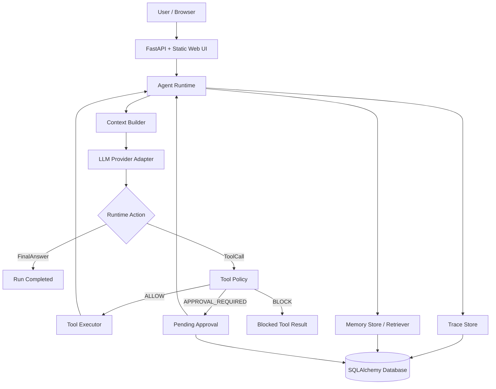
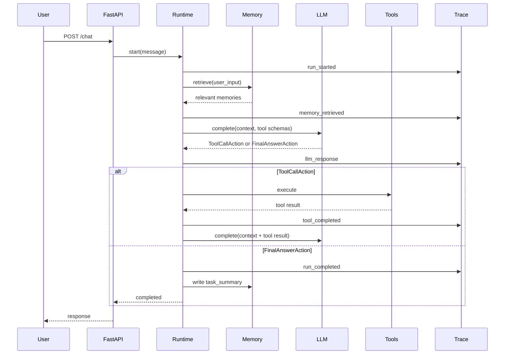
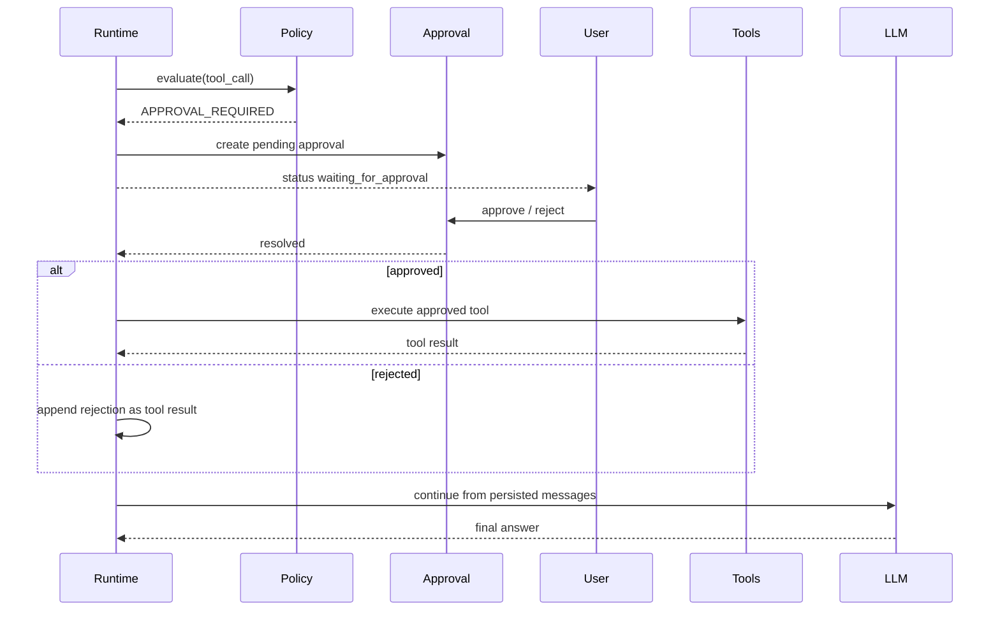
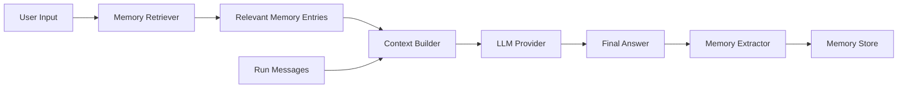

# Architecture

## System Architecture

```mermaid
flowchart TD
    U[User / Browser] --> F[FastAPI + Static Web UI]
    F --> R[Agent Runtime]
    R --> C[Context Builder]
    C --> L[LLM Provider Adapter]
    L --> A{Runtime Action}
    A -->|FinalAnswer| Done[Run Completed]
    A -->|ToolCall| P[Tool Policy]
    P -->|ALLOW| E[Tool Executor]
    P -->|APPROVAL_REQUIRED| H[Pending Approval]
    P -->|BLOCK| B[Blocked Tool Result]
    E --> R
    H --> R
    R --> T[Trace Store]
    R --> M[Memory Store / Retriever]
    T --> DB[(SQLAlchemy Database)]
    M --> DB
    H --> DB
```

## Agent Loop Sequence

```mermaid
sequenceDiagram
    participant User
    participant API as FastAPI
    participant Runtime
    participant Memory
    participant LLM
    participant Tools
    participant Trace

    User->>API: POST /chat
    API->>Runtime: start(message)
    Runtime->>Trace: run_started
    Runtime->>Memory: retrieve(user_input)
    Memory-->>Runtime: relevant memories
    Runtime->>Trace: memory_retrieved
    Runtime->>LLM: complete(context, tool schemas)
    LLM-->>Runtime: ToolCallAction or FinalAnswerAction
    Runtime->>Trace: llm_response
    alt ToolCallAction
        Runtime->>Tools: execute
        Tools-->>Runtime: tool result
        Runtime->>Trace: tool_completed
        Runtime->>LLM: complete(context + tool result)
    else FinalAnswerAction
        Runtime->>Trace: run_completed
        Runtime->>Memory: write task_summary
        Runtime-->>API: completed
    end
    API-->>User: response
```

## Approval Pause / Resume Flow

```mermaid
sequenceDiagram
    participant Runtime
    participant Policy
    participant Approval
    participant User
    participant Tools
    participant LLM

    Runtime->>Policy: evaluate(tool_call)
    Policy-->>Runtime: APPROVAL_REQUIRED
    Runtime->>Approval: create pending approval
    Runtime-->>User: status waiting_for_approval
    User->>Approval: approve / reject
    Approval-->>Runtime: resolved
    alt approved
        Runtime->>Tools: execute approved tool
        Tools-->>Runtime: tool result
    else rejected
        Runtime->>Runtime: append rejection as tool result
    end
    Runtime->>LLM: continue from persisted messages
    LLM-->>Runtime: final answer
```

## Memory / Context Flow

```mermaid
flowchart LR
    Input[User Input] --> Retriever[Memory Retriever]
    Retriever --> Entries[Relevant Memory Entries]
    Entries --> Builder[Context Builder]
    History[Run Messages] --> Builder
    Builder --> LLM[LLM Provider]
    LLM --> Answer[Final Answer]
    Answer --> Extractor[Memory Extractor]
    Extractor --> Store[Memory Store]
```
